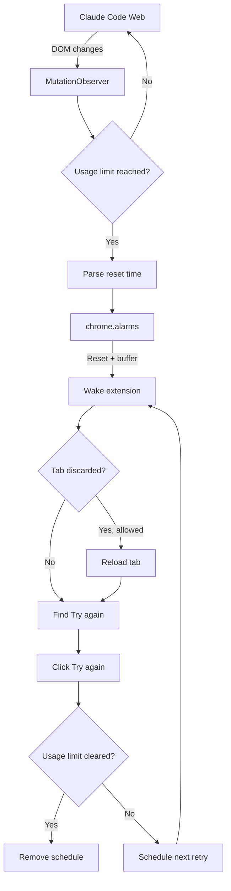

# Claude Code Web Auto-Retry

[](https://github.com/VoidGravity/Claude-Code-Web-Auto-Retry)
[](https://github.com/VoidGravity/Claude-Code-Web-Auto-Retry/actions/workflows/ci.yml)
[](SECURITY.md)
[](LICENSE)
[](https://github.com/VoidGravity/Claude-Code-Web-Auto-Retry/stargazers)

**Automatically retry Claude Code on the web when your usage limit resets.**

Claude Code Web can stop a long-running task with:

> **Usage limit reached**  
> You've reached your usage limit. Try again after your limit resets.  
> **Resets at 4:10 AM**

This tiny Chrome / Edge extension detects that state, waits until the reset time, and clicks **Try again** for you. If usage has not actually returned yet, it retries again at a configurable interval.

No prompts are injected. No conversations are summarized. No telemetry is sent anywhere.

> **Built for Claude Code on the web (`claude.ai`) — not the Claude Code CLI.**

## Why this exists

Claude Code Web can run remotely for a long time, which is useful until a session hits an account usage limit while you are asleep or away from the browser. The work is then blocked until somebody manually presses **Try again** after the reset.

Claude Code Web Auto-Retry removes that babysitting step:

```text
Claude is working
      ↓
Usage limit reached
      ↓
Reads "Resets at 4:10 AM"
      ↓
Schedules a browser alarm
      ↓
Reset time + safety buffer
      ↓
Clicks "Try again"
      ↓
Verifies Claude resumed
      ↓
Still limited? Retry again later
```

## Features

- **Automatic usage-limit detection** for Claude Code Web
- **Reset-time parsing** for formats such as `4:10 AM`, `16:30`, and `resets in 2h 15m`
- **Chrome alarms instead of constant polling** while waiting
- **Works with background Claude tabs**
- **Optional recovery of discarded tabs** by reloading them at retry time
- **Automatic retry verification** after clicking **Try again**
- **Configurable retry interval, buffer, and maximum attempts**
- **Multiple Claude tabs supported** with independent retry schedules
- **Manual “Retry now” control** from the extension popup
- **No analytics, telemetry, remote scripts, external APIs, or data uploads**
- **Open source and intentionally small**

## Install

### Chrome

1. Download or clone this repository.
2. Open `chrome://extensions/`.
3. Enable **Developer mode**.
4. Click **Load unpacked**.
5. Select the repository folder.
6. Reload your open Claude Code Web tab once.

### Microsoft Edge

1. Download or clone this repository.
2. Open `edge://extensions/`.
3. Enable **Developer mode**.
4. Click **Load unpacked**.
5. Select the repository folder.
6. Reload your Claude Code Web tab once.

```bash
git clone https://github.com/VoidGravity/Claude-Code-Web-Auto-Retry.git
```

There is no build step and no dependency installation.

## How it works

The extension is intentionally event-driven rather than constantly hammering Claude's page.



### Detection

`content.js` watches DOM mutations and looks primarily for visible text rather than fragile private CSS class names. It detects usage-limit text, parses the reset timestamp from the page, and finds a visible **Try again** / **Retry** control.

The reset timestamp and button do **not** need to be inside the same HTML container. Claude currently renders these pieces in separate parts of the interface in some layouts.

### Scheduling

`background.js` stores one retry schedule per Claude tab and uses `chrome.alarms` to wake close to the actual reset time. It does not run a 2-second or 3-second polling loop all night.

### Verification

After clicking **Try again**, the extension waits for the UI to transition and checks whether the usage-limit state disappeared. If the account is still limited, another attempt is scheduled.

## Default settings

| Setting | Default | Purpose |
|---|---:|---|
| Enabled | Yes | Master auto-retry switch |
| Reset buffer | 45 seconds | Wait a little past Anthropic's displayed reset time |
| Retry interval | 60 seconds | Delay between attempts if usage is still unavailable |
| Maximum attempts | 10 | Prevent endless retry loops |
| Reload discarded tabs | Yes | Recover tabs Chrome unloaded to save memory |

All settings are available from the extension popup.

## Privacy and security

The extension requests only the capabilities needed to detect and retry Claude Web sessions:

| Permission | Why |
|---|---|
| `storage` | Save settings and retry schedules |
| `alarms` | Wake near the usage reset time |
| `tabs` | Track Claude tabs and recover discarded tabs |
| `scripting` | Re-inject the content script if Chrome unloaded it |
| `https://claude.ai/*` | Run only on Claude's website |

There are **no third-party network calls** in the extension source. It does not upload conversation content, usage data, account information, or telemetry.

See [SECURITY.md](SECURITY.md) for the security policy and threat model.

## What it does not do

This project is deliberately narrow.

- It does **not** bypass Anthropic usage limits.
- It waits for the usage limit to reset normally.
- It does **not** buy extra usage or interact with billing.
- It does **not** send `continue` prompts into your conversation.
- It does **not** summarize or compress your context.
- It does **not** automate the Claude Code CLI.
- It does **not** keep your computer awake.

If the computer is asleep when the reset occurs, Chrome's alarm runs after the computer/browser wakes.

## Troubleshooting

### The limit was detected but nothing happened at reset

Open the extension popup and confirm the Claude session appears under **Scheduled sessions**. Check that auto-retry is enabled and that **Max attempts** has not been reached.

### Chrome discarded the Claude tab

Leave **Reload discarded tabs at reset** enabled. The extension will reload the tab before attempting the retry.

### Claude changed its UI

Claude's web interface is not a stable public DOM API. This extension minimizes selector dependence, but a substantial UI change can still break detection. Open an issue with a screenshot and the exact visible limit/reset text.

### I see the usage limit but no reset time

If the limit text is detected without a parsable reset time, the extension falls back to checking again after five minutes rather than guessing a reset timestamp.

## Development

There are no runtime dependencies or build tools.

```text
Claude-Code-Web-Auto-Retry/
├── manifest.json
├── shared.js          # parsing + shared defaults
├── content.js         # DOM detection and Try again interaction
├── background.js      # alarms, schedules, retries, tab recovery
├── popup.html
├── popup.css
├── popup.js
└── tests/
    └── parser.test.cjs
```

Run the reset-time parser tests:

```bash
node tests/parser.test.cjs
```

Basic syntax checks:

```bash
node --check shared.js
node --check content.js
node --check background.js
node --check popup.js
```

Contributions are welcome. See [CONTRIBUTING.md](CONTRIBUTING.md).

## Compatibility

| Platform | Status |
|---|---|
| Claude Code on the web | ✅ Target platform |
| Google Chrome | ✅ Supported |
| Microsoft Edge | ✅ Supported |
| Chromium browsers with Manifest V3 | 🟡 Likely, not all tested |
| Claude Code CLI | ❌ Not this project |
| Claude Desktop native UI | ❌ Not this project |

## FAQ

### Does this bypass Claude's usage limit?

No. It simply waits until the account's displayed reset time and then retries the existing Claude Code Web session.

### Does the tab need to stay focused?

No. The retry is coordinated by the extension background service worker and works with background tabs. If Chrome fully discards the tab, the extension can reload it first.

### Does it read my Claude conversations?

The content script can access the Claude page because that is required to detect the visible usage-limit state. The project does not transmit page contents anywhere, and there is no telemetry or external API call in the extension.

### Why not just poll every few seconds?

Because waiting several hours for a reset does not require thousands of DOM scans. The extension reacts to page mutations while the page is active and uses a scheduled browser alarm for the actual reset.

### Why add a safety buffer after the displayed reset time?

Usage availability may not become usable at the exact displayed second. The default 45-second buffer reduces pointless immediate failures, and you can change it in the popup.

## Related search terms / use cases

This project is for people looking for a **Claude Code web auto retry**, **Claude usage limit auto retry**, **Claude Code usage limit reached fix**, **retry Claude after usage reset**, **Claude Code web automation**, or a **Chrome extension that clicks Try again after Claude usage resets**.

## Disclaimer

Claude, Claude Code, and Anthropic are trademarks of their respective owners. This project is an independent open-source utility and is not affiliated with, endorsed by, or sponsored by Anthropic.

## License

[MIT](LICENSE)

---

If this saves one unattended or overnight Claude Code run, consider starring the repository so other people searching for the same problem can find it.
